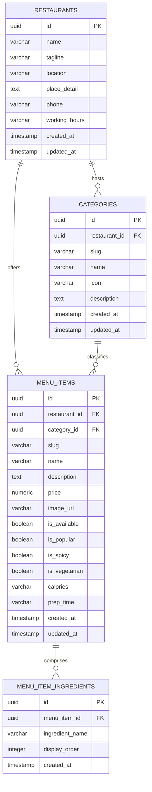

# Wow Burger — Relational Database Schema Design (MVP)

This document outlines the official Minimal Viable Product (MVP) relational database schema for **Wow Burger**. This schema is designed to transition the application's current static JSON-based digital menu (`menu.json`) into a highly structured, scalable, and production-ready relational database (such as PostgreSQL on Cloud SQL).

---

## 1. Schema Purpose

The purpose of this database schema is to provide a reliable, ACID-compliant data store for the **Wow Burger Digital Menu**. 
Specifically, it aims to:
- **Centralize Restaurant Configurations**: House location address, telephone contacts, operating schedules, and local coordinates.
- **Support Multi-Location and Scaling**: Design database relations with an explicit `restaurant_id` reference to easily scale to multiple branches or franchises (e.g., adding another spot beyond Sabiyan, Dire Dawa).
- **Control Menu and Dynamic Cards**: Actively manage gourmet categories, individual recipes, pricing, real-time availability, and localized specs (heat indexes, allergens, prep times).
- **Optimize Operational Read/Write Speeds**: Enable lightweight queries to update ingredient metrics and toggle dynamic inventory (such as marking a popular burger "Sold Out" instantly without code redeployment).

---

## 2. Entity Relationship Diagram (ERD)

A clean representation of relationships among the core tables of the digital menu system.



---

## 3. Detailed Table Specifications

### 3.1 `restaurants` Table
Stores high-level restaurant brand meta-profiles, phone lines, and operating regimes.

| Column | Type | Constraints / Attributes | Description |
| :--- | :--- | :--- | :--- |
| `id` | `UUID` | `PRIMARY KEY`, `DEFAULT gen_random_uuid()` | Unique identifier for the branch. |
| `name` | `VARCHAR(100)` | `NOT NULL` | Brand name (e.g., "Wow Burger"). |
| `tagline` | `VARCHAR(255)` | | Short punchy customer facing slogan. |
| `location` | `VARCHAR(255)` | `NOT NULL` | Physical city region (e.g., "Sabiyan, Dire Dawa"). |
| `place_detail` | `TEXT` | `NOT NULL` | Precise description (e.g., "Across Sabiyan Terminal"). |
| `phone` | `VARCHAR(20)` | `NOT NULL`, `UNIQUE` | Contact hotline (e.g., "+251986671224"). |
| `working_hours` | `VARCHAR(100)` | `NOT NULL` | Dynamic business schedule of the branch. |
| `created_at` | `TIMESTAMP` | `DEFAULT CURRENT_TIMESTAMP` | Internal registration audit log. |
| `updated_at` | `TIMESTAMP` | `DEFAULT CURRENT_TIMESTAMP` | Last updated profile state trigger. |

---

### 3.2 `categories` Table
Organizes dishes into browsable panels (e.g., Artisan Food, Premium Coffee, Chilled Drinks, Sweet Desserts).

| Column | Type | Constraints / Attributes | Description |
| :--- | :--- | :--- | :--- |
| `id` | `UUID` | `PRIMARY KEY`, `DEFAULT gen_random_uuid()` | Unique identifier for the category. |
| `restaurant_id` | `UUID` | `NOT NULL`, `FOREIGN KEY` | Reference link to `restaurants.id` |
| `slug` | `VARCHAR(50)` | `NOT NULL`, `UNIQUE` | URL-friendly keyword identifier (e.g., `coffee`). |
| `name` | `VARCHAR(100)` | `NOT NULL` | Readable visual tag (e.g., "Premium Coffee"). |
| `icon` | `VARCHAR(10)` | `NOT NULL` | UI single unicode glyph/emoji indicator (e.g., `☕`). |
| `description` | `TEXT` | `NOT NULL` | Explanatory text for the tab header. |
| `created_at` | `TIMESTAMP` | `DEFAULT CURRENT_TIMESTAMP` | Record creation. |
| `updated_at` | `TIMESTAMP` | `DEFAULT CURRENT_TIMESTAMP` | Profile adjustment history log. |

---

### 3.3 `menu_items` Table
Houses core master files for food recipes, pricing in ETB, and responsive asset locations.

| Column | Type | Constraints / Attributes | Description |
| :--- | :--- | :--- | :--- |
| `id` | `UUID` | `PRIMARY KEY`, `DEFAULT gen_random_uuid()` | Unique identifier for the recipe item. |
| `restaurant_id` | `UUID` | `NOT NULL`, `FOREIGN KEY` | Reference link to `restaurants.id` |
| `category_id` | `UUID` | `NOT NULL`, `FOREIGN KEY` | Reference link to `categories.id` (cascaded). |
| `slug` | `VARCHAR(100)` | `NOT NULL`, `UNIQUE` | Unique URL handle selector (e.g., `wow-classic-cheese`). |
| `name` | `VARCHAR(150)` | `NOT NULL` | Printed title of the dish. |
| `description` | `TEXT` | `NOT NULL` | Extended kitchen culinary profile write-up. |
| `price` | `NUMERIC(10, 2)` | `NOT NULL`, `CHECK (price >= 0)` | Cost value recorded details in ETB. |
| `image_url` | `VARCHAR(512)` | `NOT NULL` | Absolute or relative image route asset pointer. |
| `is_available` | `BOOLEAN` | `DEFAULT true` | Dynamic inventory flag. Triggers 'Sold Out' card in UI. |
| `is_popular` | `BOOLEAN` | `DEFAULT false` | Puts visual star and priority flag on UI feed. |
| `is_spicy` | `BOOLEAN` | `DEFAULT false` | Displays custom warning icon on details page. |
| `is_vegetarian` | `BOOLEAN` | `DEFAULT false` | Displays organic tag identifier on item listings. |
| `calories` | `VARCHAR(30)` | | Estimated calorical fuel value indicators. |
| `prep_time` | `VARCHAR(30)` | | Cooking delay metrics before service. |
| `created_at` | `TIMESTAMP` | `DEFAULT CURRENT_TIMESTAMP` | Registry creation audit. |
| `updated_at` | `TIMESTAMP` | `DEFAULT CURRENT_TIMESTAMP` | Active timestamp of the last recipe change. |

---

### 3.4 `menu_item_ingredients` Table
A detailed relational lookup schema replacing simple text arrays to allow fine-grained filter querying.

| Column | Type | Constraints / Attributes | Description |
| :--- | :--- | :--- | :--- |
| `id` | `UUID` | `PRIMARY KEY`, `DEFAULT gen_random_uuid()` | Unique key of the ingredient. |
| `menu_item_id` | `UUID` | `NOT NULL`, `FOREIGN KEY` | Reference link to `menu_items.id` (Cascaded on Delete). |
| `ingredient_name` | `VARCHAR(150)` | `NOT NULL` | Name of ingredient raw element (e.g., "Avocado Paste"). |
| `display_order` | `INTEGER` | `NOT NULL`, `DEFAULT 0` | Render ordering sequence inside item card overlays. |
| `created_at` | `TIMESTAMP` | `DEFAULT CURRENT_TIMESTAMP` | Internal timestamp logs. |

---

## 4. Key Constraints & Data Integrity

- **Unique Slugs**: Both `categories.slug` and `menu_items.slug` guarantee search-engine friendly routes that prevent overlapping system conflicts.
- **Foreign Key Cascade**: Deleting a category or parent restaurant will safely trigger database cascades or re-associations depending on setup guidelines, protecting orphaned items.
- **Consistent Pricing Unit**: The `menu_items.price` field is strictly defined using a highly precise `NUMERIC` format instead of volatile double/floats, preventing floating-point rounding errors during multi-item calculations. All prices represent the localized currency of **ETB**.
- **Indexing Recommendations**: 
  - Substantial improvements in menu discovery speed can be gained by indexing `menu_items.category_id` and indexing `menu_items.slug`.
  - Multi-location filtering queries can be significantly boosted using double composite indexes on `(restaurant_id, is_available)`.

---

## 5. PostgreSQL DDL SQL Statements

Below is the production-ready SQL (PostgreSQL compatible) code block containing the DDL structure to provision and seed the tables in a database system like Cloud SQL. All SQL code is placed strictly inside standard markdown enclosures.

```sql
-- Enable standard UUID generation extension
CREATE EXTENSION IF NOT EXISTS "uuid-ossp";

-- 1. Create Restaurants Table
CREATE TABLE restaurants (
    id UUID PRIMARY KEY DEFAULT gen_random_uuid(),
    name VARCHAR(100) NOT NULL,
    tagline VARCHAR(255),
    location VARCHAR(255) NOT NULL,
    place_detail TEXT NOT NULL,
    phone VARCHAR(20) NOT NULL UNIQUE,
    working_hours VARCHAR(100) NOT NULL,
    created_at TIMESTAMP WITH TIME ZONE DEFAULT CURRENT_TIMESTAMP,
    updated_at TIMESTAMP WITH TIME ZONE DEFAULT CURRENT_TIMESTAMP
);

-- 2. Create Categories Table
CREATE TABLE categories (
    id UUID PRIMARY KEY DEFAULT gen_random_uuid(),
    restaurant_id UUID NOT NULL REFERENCES restaurants(id) ON DELETE CASCADE,
    slug VARCHAR(50) NOT NULL,
    name VARCHAR(100) NOT NULL,
    icon VARCHAR(10) NOT NULL,
    description TEXT NOT NULL,
    created_at TIMESTAMP WITH TIME ZONE DEFAULT CURRENT_TIMESTAMP,
    updated_at TIMESTAMP WITH TIME ZONE DEFAULT CURRENT_TIMESTAMP,
    CONSTRAINT uq_categories_slug_restaurant UNIQUE (slug, restaurant_id)
);

-- 3. Create Menu Items Table
CREATE TABLE menu_items (
    id UUID PRIMARY KEY DEFAULT gen_random_uuid(),
    restaurant_id UUID NOT NULL REFERENCES restaurants(id) ON DELETE CASCADE,
    category_id UUID NOT NULL REFERENCES categories(id) ON DELETE CASCADE,
    slug VARCHAR(100) NOT NULL,
    name VARCHAR(150) NOT NULL,
    description TEXT NOT NULL,
    price NUMERIC(10, 2) NOT NULL CHECK (price >= 0),
    image_url VARCHAR(512) NOT NULL,
    is_available BOOLEAN NOT NULL DEFAULT TRUE,
    is_popular BOOLEAN NOT NULL DEFAULT FALSE,
    is_spicy BOOLEAN NOT NULL DEFAULT FALSE,
    is_vegetarian BOOLEAN NOT NULL DEFAULT FALSE,
    calories VARCHAR(30),
    prep_time VARCHAR(30),
    created_at TIMESTAMP WITH TIME ZONE DEFAULT CURRENT_TIMESTAMP,
    updated_at TIMESTAMP WITH TIME ZONE DEFAULT CURRENT_TIMESTAMP,
    CONSTRAINT uq_menu_items_slug_restaurant UNIQUE (slug, restaurant_id)
);

-- 4. Create Menu Item Ingredients Table
CREATE TABLE menu_item_ingredients (
    id UUID PRIMARY KEY DEFAULT gen_random_uuid(),
    menu_item_id UUID NOT NULL REFERENCES menu_items(id) ON DELETE CASCADE,
    ingredient_name VARCHAR(150) NOT NULL,
    display_order INTEGER NOT NULL DEFAULT 0,
    created_at TIMESTAMP WITH TIME ZONE DEFAULT CURRENT_TIMESTAMP
);

-- 5. Database Performance Optimization Indexes
CREATE INDEX idx_menu_items_category ON menu_items(category_id);
CREATE INDEX idx_menu_items_slug ON menu_items(slug);
CREATE INDEX idx_menu_items_restaurant_available ON menu_items(restaurant_id, is_available);
CREATE INDEX idx_menu_item_ingredients_item ON menu_item_ingredients(menu_item_id);
```
